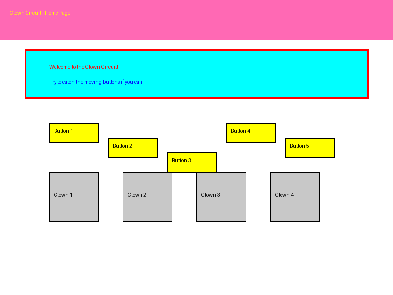
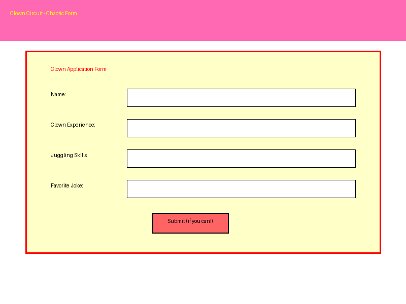

# 🤡 Clown Circuit - Silly UI Challenge 🤡

This project is part of the "Silly UI Challenge" - an intentionally chaotic and frustrating user interface designed to showcase anti-patterns in UI/UX design.

## Project Screenshots

Here are some screenshots of the intentionally chaotic UI:

### Home Page


### Chaotic Form


### Audio Controls


## Project Concept

Clown Circuit is a deliberately absurd and frustrating web interface that breaks conventional UI/UX rules. It features:

- Chaotic layout with unpredictable element positioning
- Moving buttons that try to escape when you hover over them
- Annoying sound effects and background music
- Infinite scroll that leads nowhere
- Confusing navigation and form elements
- Deliberately inconsistent styling and typography

## How to Interact with the UI

1. **Try to navigate**: Good luck catching those moving buttons!
2. **Fill out forms**: Watch as your inputs get transformed in unexpected ways
3. **Click elements**: Prepare for surprising responses and animations
4. **Scroll down**: Experience the never-ending journey of infinite scroll
5. **Toggle audio**: Find the hidden audio controls (if you can!)

## Deploying to GitHub Pages

### Prerequisites
- GitHub account
- Git installed on your local machine

### Step-by-Step Deployment Instructions

1. **Create a GitHub repository**
   - Go to [GitHub](https://github.com) and sign in
   - Click the "+" icon in the top right corner and select "New repository"
   - Name your repository (e.g., "clown-circuit-silly-ui")
   - Choose "Public" visibility
   - Click "Create repository"

2. **Push the code to GitHub**
   - Open a terminal/command prompt
   - Navigate to the project directory
   - Initialize Git (if not already done):
     ```
     git init
     ```
   - Add all files:
     ```
     git add .
     ```
   - Commit the files:
     ```
     git commit -m "Initial commit"
     ```
   - Add the remote repository:
     ```
     git remote add origin https://github.com/YOUR_USERNAME/clown-circuit-silly-ui.git
     ```
   - Push to GitHub:
     ```
     git push -u origin main
     ```

3. **Enable GitHub Pages**
   - Go to your repository on GitHub
   - Click "Settings" tab
   - Scroll down to "GitHub Pages" section
   - Under "Source", select "main" branch
   - Click "Save"
   - Wait a few minutes for your site to be published

4. **Access your deployed site**
   - Your site will be available at: `https://YOUR_USERNAME.github.io/clown-circuit-silly-ui/`

## Local Testing Instructions

To test the project locally:

1. **Clone the repository**
   ```
   git clone https://github.com/YOUR_USERNAME/clown-circuit-silly-ui.git
   cd clown-circuit-silly-ui
   ```

2. **Open the project**
   - Open the `index.html` file in your web browser
   - You can use a local server for better testing:
     ```
     # Using Python
     python -m http.server
     
     # Then open http://localhost:8000 in your browser
     ```

3. **Test all features**
   - Verify that all visual elements display properly
   - Test interactive elements like moving buttons
   - Check that audio functionality works
   - Verify that infinite scroll functions as expected

## Intentionally Bad UI Elements Explained

This project deliberately implements several anti-patterns in UI/UX design:

1. **Moving Buttons**: Buttons that move away when you try to click them, creating frustration and making simple tasks difficult.

2. **Chaotic Layout**: Inconsistent spacing, alignment, and visual hierarchy that makes it hard to understand the page structure.

3. **Overwhelming Colors**: Bright, clashing colors that strain the eyes and create visual confusion.

4. **Annoying Audio**: Sound effects and music that play automatically and increase in volume over time.

5. **Infinite Scroll Trap**: Content that continuously loads, making it impossible to reach the bottom of the page.

6. **Confusing Forms**: Form elements that behave unpredictably, transform user input, or provide misleading feedback.

7. **Inconsistent Typography**: Multiple font families, sizes, and styles used without a coherent system.

8. **Unexpected Animations**: Elements that rotate, wobble, or change appearance randomly.

## Credits

- **Clown Images**: Generated for this project (Public Domain)
- **GIFs**:
  - Clown Juggling GIF: Via Tenor (Free to share)
  - Additional GIFs: Via Tenor (Free to share)
- **Audio**:
  - "Circus of Freaks" from FreePD.com (CC0 1.0 Universal)
  - "Circus March" from Free Music Archive (CC BY-NC-SA 3.0)
  - "Circus Music" from Freesound.org (Creative Commons)

See `assets.json` for detailed attribution information.

## License

This project is available under the MIT License. Feel free to use it as an example of what NOT to do in UI/UX design.